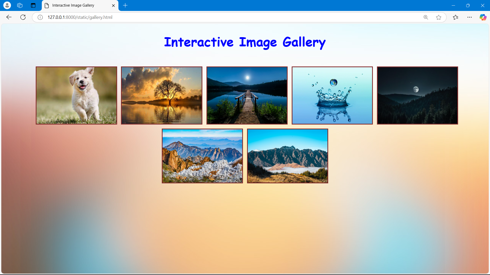

# Ex.08 Design of Interactive Image Gallery
# Date:13/12/2024
# AIM:
To design a web application for an inteactive image gallery with minimum five images.

# DESIGN STEPS:
## Step 1:
Clone the github repository and create Django admin interface.

## Step 2:
Change settings.py file to allow request from all hosts.

## Step 3:
Use CSS for positioning and styling.

## Step 4:
Write JavaScript program for implementing interactivity.

## Step 5:
Validate the HTML and CSS code.

## Step 6:
Publish the website in the given URL.

# PROGRAM :
```
<!DOCTYPE html>
<html lang="en">
<head>
  <meta charset="UTF-8">
  <meta name="viewport" content="width=device-width, initial-scale=1.0">
  <title>Interactive Image Gallery</title>
  <style>
    body {
  font-family: Arial, sans-serif;
  background-color: #f3f3f3;
  background-size: 100%;
  margin: 0;
  padding: 0;
}

.gallery {
  display: flex;
  flex-wrap: wrap;
  gap: 10px;
  padding: 20px;
  justify-content: center;
}

.gallery-item {
  width: 200px;
  height: auto;
  cursor: pointer;
  border: 2px solid #842b2b;
  transition: transform 0.01s;
}

.gallery-item:hover {
  transform: scale(1.2);
}

.modal {
  display: none;
  position: fixed;
  z-index: 1;
  left: 0;
  top: 0;
  width: 100%;
  height: 100%;
  background-color: rgba(0, 0, 0, 0.8);
  justify-content: center;
  align-items: center;
}

.modal-content {
  max-width: 80%;
  max-height: 80%;
}

.close {
  position: absolute;
  top: 20px;
  right: 30px;
  font-size: 30px;
  color: white;
  cursor: pointer;
}
  </style>
  <script>
    function openModal(image) {
  const modal = document.getElementById('imageModal');
  const modalImg = document.getElementById('modalImage');
  modal.style.display = "flex";
  modalImg.src = image.src;
}
function closeModal() {
  const modal = document.getElementById('imageModal');
  modal.style.display = "none";
}
  </script>
</head>
<body background="https://sac-ace.ca/wp-content/uploads/layerslider/LayerSlider-5-responsive-demo-slider/bg.jpg" style="background-repeat: no-repeat; ">
 <h1 align="center" style="font-family :cursive ;color: blue;">Interactive Image Gallery</h1>
  <div class="gallery">
    <br><br><br>
    
    
    
    
        
        
        
  </div>
  <div id="imageModal" class="modal" onclick="closeModal()">
    <span class="close">&times;</span>
    
  </div>
</body>
</html>
```
# OUTPUT:

# RESULT:
The program for designing an interactive image gallery using HTML, CSS and JavaScript is executed successfully.
